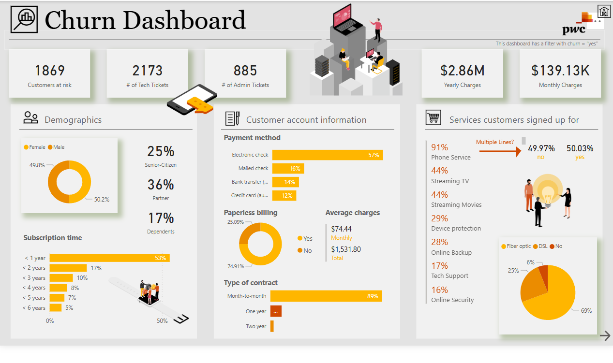
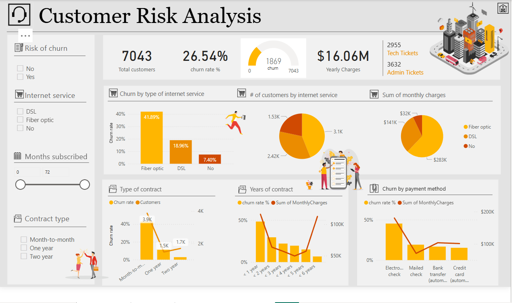

# 📊 PwC Task 4 – Power BI Dashboard

This repository contains a Power BI project developed as part of PwC's Task 4 assignment. It focuses on **Customer Churn Analysis** using a variety of filters, visuals, and KPIs to help understand customer behavior, churn rates, and contributing factors.

---

## 📂 Contents

- `PwC task4.pbix` – Main Power BI dashboard file
- `assets/churn_dashboard.png` – Churn Dashboard screenshot
- `assets/customer_risk_analysis.png` – Customer Risk Analysis screenshot

---

## 📈 Dashboard Overview

### 1. Churn Dashboard

Key Highlights:
- 📌 1869 customers at risk
- 💳 $2.86M yearly charges | $139.13K monthly charges
- 🔍 Breakdown by gender, age, tenure, billing type, service types
- 📡 Payment and subscription methods

---

### 2. Customer Risk Analysis

Key Insights:
- 🧮 26.54% churn rate among 7043 total customers
- 📊 Churn breakdown by internet service, contract type, payment method
- 📅 Monthly charges and tenure analysis

---

## 🛠 Built With

- **Power BI Desktop**
- Data modeling & DAX
- Custom visuals & slicers

---

## 📌 How to Use

1. Clone the repository
2. Open the `.pbix` file using [Power BI Desktop](https://powerbi.microsoft.com/)
3. Explore insights using slicers and filters

---

## 📬 Contact

If you have questions, feel free to reach out or open an issue!

---

